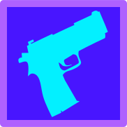

## FPS GAME GODOT

Simple FPS project made in Godot mostly following youtube tutorial by StayAtHomeDev

[Template Project from StayAtHomeDev](https://github.com/StayAtHomeDev-Git/FPS-Godot-Basic-Setup)

[Youtube Tutorial Playlist](https://youtube.com/playlist?list=PLEHvj4yeNfeF6s-UVs5Zx5TfNYmeCiYwf&si=zT8iuG1SUR2cG8Ud)
